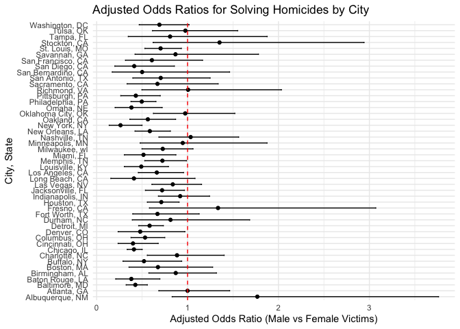

p8105_hw6_mw3845
================
Minghe Wang
2024-12-02

# Problem 1

# Problem 2

``` r
homicide_df = read.csv("./data/homicide-data.csv")

homicide_df <- homicide_df %>% 
  mutate(
    city_state = paste(city, state, sep = ", "),
    solved_case = case_when(
      disposition %in% c("Closed without arrest", "Open/No arrest") ~ 0,
      disposition == "Closed by arrest" ~ 1
    )
  ) %>% 
  filter(
    !(city_state %in% c("Dallas, TX", "Phoenix, AZ", "Kansas City, MO", "Tulsa, AL")) &
    victim_race %in% c("White", "Black")
  ) %>% 
  mutate(
    victim_age = ifelse(victim_age == "Unknown", NA, victim_age),
    victim_age = as.numeric(as.character(victim_age))
  )
```

After loading and cleaning data, the dataset `homicide_df` contains
39693 rows and 14 columns. Key variables includes `victim_age`,
`victim_race`, `city_state`, `solved_case`, etc. The variables will be
used for model fitting for each city.

``` r
baltimore_df = homicide_df %>% 
  filter(city_state == "Baltimore, MD") %>% 
  select(solved_case, victim_age, victim_race, victim_sex)

baltimore_glm = 
  baltimore_df |> 
  glm(solved_case ~ victim_age + victim_race + victim_sex, data = _, family = binomial())

baltimore_result = baltimore_glm |> 
  broom::tidy(
    exponentiate = TRUE,
    conf.int = TRUE
  ) |> 
  filter(term == "victim_sexMale") |>
  select(term, estimate, conf.low, conf.high, p.value)

baltimore_result |> 
  knitr::kable(digits = 4)
```

| term           | estimate | conf.low | conf.high | p.value |
|:---------------|---------:|---------:|----------:|--------:|
| victim_sexMale |   0.4255 |   0.3242 |    0.5576 |       0 |

We select `Baltimore, MD`’s data and fit into binary logistic regression
model with `glm`.

``` r
city_model = homicide_df %>% 
  group_by(city_state) %>% 
  nest() %>% 
  mutate(
    glm_model = map(
      data,
      ~ glm(solved_case ~ victim_age + victim_race + victim_sex, data = ., family = binomial())
    )
  ) 

city_result = city_model %>% 
  mutate(
    tidy_glm_model = map(glm_model, broom::tidy)
  ) %>% 
  unnest(tidy_glm_model) %>% 
  mutate(
    OR = exp(estimate),
    ci_lower = exp(estimate - 1.96 * std.error),
    ci_upper = exp(estimate + 1.96 * std.error)
  ) %>% 
  filter(term == "victim_sexMale") %>%
  select(
    city_state,
    OR,
    ci_lower,
    ci_upper,
    p.value
  )

city_result %>% 
  knitr::kable(digits = 4)
```

| city_state         |     OR | ci_lower | ci_upper | p.value |
|:-------------------|-------:|---------:|---------:|--------:|
| Albuquerque, NM    | 1.7675 |   0.8307 |   3.7609 |  0.1393 |
| Atlanta, GA        | 1.0001 |   0.6836 |   1.4631 |  0.9997 |
| Baltimore, MD      | 0.4255 |   0.3246 |   0.5579 |  0.0000 |
| Baton Rouge, LA    | 0.3814 |   0.2093 |   0.6953 |  0.0017 |
| Birmingham, AL     | 0.8700 |   0.5743 |   1.3180 |  0.5111 |
| Boston, MA         | 0.6740 |   0.3560 |   1.2760 |  0.2257 |
| Buffalo, NY        | 0.5206 |   0.2898 |   0.9352 |  0.0290 |
| Charlotte, NC      | 0.8839 |   0.5570 |   1.4027 |  0.6004 |
| Chicago, IL        | 0.4101 |   0.3360 |   0.5006 |  0.0000 |
| Cincinnati, OH     | 0.3998 |   0.2361 |   0.6771 |  0.0006 |
| Columbus, OH       | 0.5325 |   0.3783 |   0.7496 |  0.0003 |
| Denver, CO         | 0.4791 |   0.2364 |   0.9707 |  0.0411 |
| Detroit, MI        | 0.5823 |   0.4622 |   0.7337 |  0.0000 |
| Durham, NC         | 0.8124 |   0.3920 |   1.6833 |  0.5761 |
| Fort Worth, TX     | 0.6690 |   0.3969 |   1.1275 |  0.1312 |
| Fresno, CA         | 1.3352 |   0.5805 |   3.0709 |  0.4964 |
| Houston, TX        | 0.7110 |   0.5577 |   0.9066 |  0.0059 |
| Indianapolis, IN   | 0.9187 |   0.6794 |   1.2423 |  0.5819 |
| Jacksonville, FL   | 0.7198 |   0.5365 |   0.9657 |  0.0283 |
| Las Vegas, NV      | 0.8373 |   0.6077 |   1.1537 |  0.2776 |
| Long Beach, CA     | 0.4102 |   0.1555 |   1.0821 |  0.0718 |
| Los Angeles, CA    | 0.6619 |   0.4581 |   0.9563 |  0.0279 |
| Louisville, KY     | 0.4906 |   0.3047 |   0.7897 |  0.0034 |
| Memphis, TN        | 0.7232 |   0.5292 |   0.9884 |  0.0420 |
| Miami, FL          | 0.5152 |   0.3045 |   0.8719 |  0.0135 |
| Milwaukee, wI      | 0.7271 |   0.4987 |   1.0602 |  0.0977 |
| Minneapolis, MN    | 0.9470 |   0.4783 |   1.8749 |  0.8757 |
| Nashville, TN      | 1.0342 |   0.6847 |   1.5622 |  0.8729 |
| New Orleans, LA    | 0.5849 |   0.4218 |   0.8112 |  0.0013 |
| New York, NY       | 0.2624 |   0.1379 |   0.4991 |  0.0000 |
| Oakland, CA        | 0.5631 |   0.3651 |   0.8684 |  0.0094 |
| Oklahoma City, OK  | 0.9741 |   0.6241 |   1.5203 |  0.9079 |
| Omaha, NE          | 0.3825 |   0.2030 |   0.7208 |  0.0030 |
| Philadelphia, PA   | 0.4963 |   0.3776 |   0.6522 |  0.0000 |
| Pittsburgh, PA     | 0.4308 |   0.2651 |   0.6999 |  0.0007 |
| Richmond, VA       | 1.0061 |   0.4980 |   2.0326 |  0.9866 |
| San Antonio, TX    | 0.7046 |   0.3977 |   1.2485 |  0.2303 |
| Sacramento, CA     | 0.6688 |   0.3347 |   1.3365 |  0.2548 |
| Savannah, GA       | 0.8670 |   0.4223 |   1.7801 |  0.6974 |
| San Bernardino, CA | 0.5003 |   0.1712 |   1.4622 |  0.2057 |
| San Diego, CA      | 0.4130 |   0.1995 |   0.8550 |  0.0172 |
| San Francisco, CA  | 0.6075 |   0.3168 |   1.1651 |  0.1336 |
| St. Louis, MO      | 0.7032 |   0.5304 |   0.9323 |  0.0144 |
| Stockton, CA       | 1.3517 |   0.6211 |   2.9416 |  0.4475 |
| Tampa, FL          | 0.8077 |   0.3478 |   1.8760 |  0.6194 |
| Tulsa, OK          | 0.9758 |   0.6136 |   1.5517 |  0.9175 |
| Washington, DC     | 0.6902 |   0.4684 |   1.0170 |  0.0608 |

``` r
city_result = city_result %>%
  arrange(OR) %>%
  mutate(city_state = factor(city_state, levels = city_state))

ggplot(city_result, aes(x = OR, y = city_state)) +
  geom_point() +
  geom_errorbar(aes(xmin =  ci_lower, xmax =  ci_upper), width = 0.2) +
  geom_vline(xintercept = 1, linetype = "dashed", color = "red") +
  xlab("Adjusted Odds Ratio (Male vs Female Victims)") +
  ylab("City, State") +
  ggtitle("Adjusted Odds Ratios for Solving Homicides by City") +
  theme_minimal()
```

<!-- -->

# Problem 3
