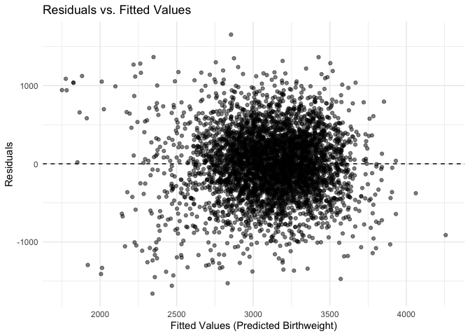
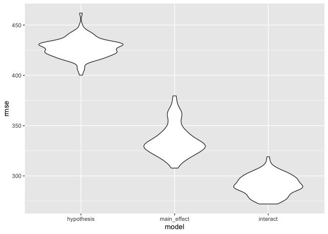

p8105_hw6_mw3845
================
Minghe Wang
2024-12-02

# Problem 1

# Problem 2

``` r
homicide_df = read.csv("./data/homicide-data.csv")

homicide_df <- homicide_df %>% 
  mutate(
    city_state = paste(city, state, sep = ", "),
    solved_case = case_when(
      disposition %in% c("Closed without arrest", "Open/No arrest") ~ 0,
      disposition == "Closed by arrest" ~ 1
    )
  ) %>% 
  filter(
    !(city_state %in% c("Dallas, TX", "Phoenix, AZ", "Kansas City, MO", "Tulsa, AL")) &
    victim_race %in% c("White", "Black")
  ) %>% 
  mutate(
    victim_age = ifelse(victim_age == "Unknown", NA, victim_age),
    victim_age = as.numeric(as.character(victim_age))
  )
```

After loading and cleaning data, the dataset `homicide_df` contains
39693 rows and 14 columns. Key variables includes `victim_age`,
`victim_race`, `city_state`, `solved_case`, etc. The variables will be
used for model fitting for each city.

``` r
baltimore_df = homicide_df %>% 
  filter(city_state == "Baltimore, MD") %>% 
  select(solved_case, victim_age, victim_race, victim_sex)

baltimore_glm = 
  baltimore_df |> 
  glm(solved_case ~ victim_age + victim_race + victim_sex, data = _, family = binomial())

baltimore_result = baltimore_glm |> 
  broom::tidy(
    exponentiate = TRUE,
    conf.int = TRUE
  ) |> 
  filter(term == "victim_sexMale") |>
  select(term, estimate, conf.low, conf.high, p.value)

baltimore_result |> 
  knitr::kable(digits = 4)
```

| term           | estimate | conf.low | conf.high | p.value |
|:---------------|---------:|---------:|----------:|--------:|
| victim_sexMale |   0.4255 |   0.3242 |    0.5576 |       0 |

We select `Baltimore, MD`‘s data and fit into binary logistic regression
model with `glm`. We use variables `victim_age`, `victim_race`,
`victim_sex` to make prediction on `solved_case`. By comparing victims’
sex, we obtain estimated odd ratio for solving homicide 0.4255117 and 1
does not falls into the 95% confidence interval. It indicate that cases
committed by male victims have less odd to be solved than cases
committed by female; and the result is statistically significant.

``` r
city_model = homicide_df %>% 
  group_by(city_state) %>% 
  nest() %>% 
  mutate(
    glm_model = map(
      data,
      ~ glm(solved_case ~ victim_age + victim_race + victim_sex, data = ., family = binomial())
    )
  ) 

city_result = city_model %>% 
  mutate(
    tidy_glm_model = map(glm_model, broom::tidy)
  ) %>% 
  unnest(tidy_glm_model) %>% 
  mutate(
    OR = exp(estimate),
    ci_lower = exp(estimate - 1.96 * std.error),
    ci_upper = exp(estimate + 1.96 * std.error)
  ) %>% 
  filter(term == "victim_sexMale") %>%
  select(
    city_state,
    OR,
    ci_lower,
    ci_upper,
    p.value
  )

city_result %>% 
  knitr::kable(digits = 4)
```

| city_state         |     OR | ci_lower | ci_upper | p.value |
|:-------------------|-------:|---------:|---------:|--------:|
| Albuquerque, NM    | 1.7675 |   0.8307 |   3.7609 |  0.1393 |
| Atlanta, GA        | 1.0001 |   0.6836 |   1.4631 |  0.9997 |
| Baltimore, MD      | 0.4255 |   0.3246 |   0.5579 |  0.0000 |
| Baton Rouge, LA    | 0.3814 |   0.2093 |   0.6953 |  0.0017 |
| Birmingham, AL     | 0.8700 |   0.5743 |   1.3180 |  0.5111 |
| Boston, MA         | 0.6740 |   0.3560 |   1.2760 |  0.2257 |
| Buffalo, NY        | 0.5206 |   0.2898 |   0.9352 |  0.0290 |
| Charlotte, NC      | 0.8839 |   0.5570 |   1.4027 |  0.6004 |
| Chicago, IL        | 0.4101 |   0.3360 |   0.5006 |  0.0000 |
| Cincinnati, OH     | 0.3998 |   0.2361 |   0.6771 |  0.0006 |
| Columbus, OH       | 0.5325 |   0.3783 |   0.7496 |  0.0003 |
| Denver, CO         | 0.4791 |   0.2364 |   0.9707 |  0.0411 |
| Detroit, MI        | 0.5823 |   0.4622 |   0.7337 |  0.0000 |
| Durham, NC         | 0.8124 |   0.3920 |   1.6833 |  0.5761 |
| Fort Worth, TX     | 0.6690 |   0.3969 |   1.1275 |  0.1312 |
| Fresno, CA         | 1.3352 |   0.5805 |   3.0709 |  0.4964 |
| Houston, TX        | 0.7110 |   0.5577 |   0.9066 |  0.0059 |
| Indianapolis, IN   | 0.9187 |   0.6794 |   1.2423 |  0.5819 |
| Jacksonville, FL   | 0.7198 |   0.5365 |   0.9657 |  0.0283 |
| Las Vegas, NV      | 0.8373 |   0.6077 |   1.1537 |  0.2776 |
| Long Beach, CA     | 0.4102 |   0.1555 |   1.0821 |  0.0718 |
| Los Angeles, CA    | 0.6619 |   0.4581 |   0.9563 |  0.0279 |
| Louisville, KY     | 0.4906 |   0.3047 |   0.7897 |  0.0034 |
| Memphis, TN        | 0.7232 |   0.5292 |   0.9884 |  0.0420 |
| Miami, FL          | 0.5152 |   0.3045 |   0.8719 |  0.0135 |
| Milwaukee, wI      | 0.7271 |   0.4987 |   1.0602 |  0.0977 |
| Minneapolis, MN    | 0.9470 |   0.4783 |   1.8749 |  0.8757 |
| Nashville, TN      | 1.0342 |   0.6847 |   1.5622 |  0.8729 |
| New Orleans, LA    | 0.5849 |   0.4218 |   0.8112 |  0.0013 |
| New York, NY       | 0.2624 |   0.1379 |   0.4991 |  0.0000 |
| Oakland, CA        | 0.5631 |   0.3651 |   0.8684 |  0.0094 |
| Oklahoma City, OK  | 0.9741 |   0.6241 |   1.5203 |  0.9079 |
| Omaha, NE          | 0.3825 |   0.2030 |   0.7208 |  0.0030 |
| Philadelphia, PA   | 0.4963 |   0.3776 |   0.6522 |  0.0000 |
| Pittsburgh, PA     | 0.4308 |   0.2651 |   0.6999 |  0.0007 |
| Richmond, VA       | 1.0061 |   0.4980 |   2.0326 |  0.9866 |
| San Antonio, TX    | 0.7046 |   0.3977 |   1.2485 |  0.2303 |
| Sacramento, CA     | 0.6688 |   0.3347 |   1.3365 |  0.2548 |
| Savannah, GA       | 0.8670 |   0.4223 |   1.7801 |  0.6974 |
| San Bernardino, CA | 0.5003 |   0.1712 |   1.4622 |  0.2057 |
| San Diego, CA      | 0.4130 |   0.1995 |   0.8550 |  0.0172 |
| San Francisco, CA  | 0.6075 |   0.3168 |   1.1651 |  0.1336 |
| St. Louis, MO      | 0.7032 |   0.5304 |   0.9323 |  0.0144 |
| Stockton, CA       | 1.3517 |   0.6211 |   2.9416 |  0.4475 |
| Tampa, FL          | 0.8077 |   0.3478 |   1.8760 |  0.6194 |
| Tulsa, OK          | 0.9758 |   0.6136 |   1.5517 |  0.9175 |
| Washington, DC     | 0.6902 |   0.4684 |   1.0170 |  0.0608 |

``` r
city_result = city_result %>%
  arrange(OR) %>%
  mutate(city_state = factor(city_state, levels = city_state))

ggplot(city_result, aes(x = OR, y = city_state)) +
  geom_point() +
  geom_errorbar(aes(xmin =  ci_lower, xmax =  ci_upper), width = 0.2) +
  geom_vline(xintercept = 1, linetype = "dashed", color = "red") +
  xlab("Adjusted Odds Ratio (Male vs Female Victims)") +
  ylab("City, State") +
  ggtitle("Adjusted Odds Ratios for Solving Homicides by City") +
  theme_minimal()
```

<!-- -->

For the adjusted odd ratio plot, we observe that the male victim
committed homicide are less likely to be solved than female committed
homicides in most cities. We need to be careful for the cities with
estimated confidence interval including 1 because it typically suggest
that the result is not statistically significant at the 95% confidence
level.

# Problem 3

``` r
bwt_df = 
  read_csv("./data/birthweight.csv") |> 
  janitor::clean_names() |>
  mutate(
    babysex = 
        case_match(babysex,
            1 ~ "male",
            2 ~ "female"
        ),
    babysex = fct_infreq(babysex),
    frace = 
        case_match(frace,
            1 ~ "white",
            2 ~ "black", 
            3 ~ "asian", 
            4 ~ "puerto rican", 
            8 ~ "other"),
    frace = fct_infreq(frace),
    mrace = 
        case_match(mrace,
            1 ~ "white",
            2 ~ "black", 
            3 ~ "asian", 
            4 ~ "puerto rican",
            8 ~ "other"),
    mrace = fct_infreq(mrace),
    malform = as.logical(malform))
```

    ## Rows: 4342 Columns: 20
    ## ── Column specification ────────────────────────────────────────────────────────
    ## Delimiter: ","
    ## dbl (20): babysex, bhead, blength, bwt, delwt, fincome, frace, gaweeks, malf...
    ## 
    ## ℹ Use `spec()` to retrieve the full column specification for this data.
    ## ℹ Specify the column types or set `show_col_types = FALSE` to quiet this message.

``` r
sapply(bwt_df, function(x) sum(is.na(x)))
```

    ##  babysex    bhead  blength      bwt    delwt  fincome    frace  gaweeks 
    ##        0        0        0        0        0        0        0        0 
    ##  malform menarche  mheight   momage    mrace   parity  pnumlbw  pnumsga 
    ##        0        0        0        0        0        0        0        0 
    ##    ppbmi     ppwt   smoken   wtgain 
    ##        0        0        0        0

After importing and cleaning the birth weight data, there are 4342 rows
and 20 columns. We factored `babysex`, `frace`, `mrace`, `malform` in
the dataset. The dataset also includes key variables like `blength`,
`gaweeks`, `bhead`, etc; which are important for out future model
fitting and comparison process. By checking for NA, we found there is no
missing value in our cleaned dataset.

``` r
hypothesis_model <- lm(bwt ~ gaweeks + babysex + ppbmi + smoken + mrace + wtgain, data = bwt_df)
summary(hypothesis_model)
```

    ## 
    ## Call:
    ## lm(formula = bwt ~ gaweeks + babysex + ppbmi + smoken + mrace + 
    ##     wtgain, data = bwt_df)
    ## 
    ## Residuals:
    ##      Min       1Q   Median       3Q      Max 
    ## -1661.67  -263.41     5.56   274.36  1653.22 
    ## 
    ## Coefficients:
    ##                    Estimate Std. Error t value Pr(>|t|)    
    ## (Intercept)        564.4222    93.9561   6.007 2.04e-09 ***
    ## gaweeks             54.1042     2.1213  25.506  < 2e-16 ***
    ## babysexfemale      -85.1445    13.0085  -6.545 6.63e-11 ***
    ## ppbmi               20.0562     2.0673   9.702  < 2e-16 ***
    ## smoken             -11.5524     0.9068 -12.739  < 2e-16 ***
    ## mraceblack        -297.6761    14.1570 -21.027  < 2e-16 ***
    ## mracepuerto rican -186.7391    29.1805  -6.399 1.72e-10 ***
    ## mraceasian        -126.7373    66.2543  -1.913   0.0558 .  
    ## wtgain               9.7874     0.6044  16.194  < 2e-16 ***
    ## ---
    ## Signif. codes:  0 '***' 0.001 '**' 0.01 '*' 0.05 '.' 0.1 ' ' 1
    ## 
    ## Residual standard error: 427.4 on 4333 degrees of freedom
    ## Multiple R-squared:  0.3048, Adjusted R-squared:  0.3036 
    ## F-statistic: 237.5 on 8 and 4333 DF,  p-value: < 2.2e-16

``` r
bwt_df <- bwt_df %>%
  add_predictions(hypothesis_model) %>%
  add_residuals(hypothesis_model)

# Plot Residuals vs. Fitted Values
ggplot(bwt_df, aes(x = pred, y = resid)) +
  geom_point(alpha = 0.5) +
  geom_hline(yintercept = 0, linetype = "dashed") +
  labs(title = "Residuals vs. Fitted Values",
       x = "Fitted Values (Predicted Birthweight)",
       y = "Residuals") +
  theme_minimal()
```

<!-- -->

In the hypothesized model that we construct, the baby’s measurement at
birth and the mother’s health information (`gaweeks`, `babysex`,
`ppbmi`, `smoken`, `mrace`, `wtgain`) are included to predict the birth
weight `bwt`. All variables are considered statistically significant
according to the summary table.

From the scatter plot of Residual vs. Prediction, we observe no specific
pattern of how residuals are distributed, which can be considered as
randomly dispersed around then 0 line. Thus we conclude that this it a
goot fit that the model appropriately captures the relationship between
predictors and the outcome.

``` r
cv_df = 
  crossv_mc(bwt_df, 100)

cv_df = 
  cv_df |> 
  mutate(
    hypothesis_mod  = map(train, \(df) lm(bwt ~ gaweeks + babysex + ppbmi + smoken + mrace + wtgain, data = df)),
    main_effect_mod  = map(train, \(df) lm(bwt ~ blength + gaweeks, data = df)),
    interaction_mod  = map(train, \(df) lm(bwt ~ (bhead + blength + babysex)^3, data = df))
  ) |> 
  mutate(
    rmse_hypothesis = map2_dbl(hypothesis_mod, test, \(mod, df) rmse(model = mod, data = df)),
    rmse_main_effect = map2_dbl(main_effect_mod, test, \(mod, df) rmse(model = mod, data = df)),
    rmse_interact = map2_dbl(interaction_mod, test, \(mod, df) rmse(model = mod, data = df)))


cv_df |> 
  select(starts_with("rmse")) |> 
  pivot_longer(
    everything(),
    names_to = "model", 
    values_to = "rmse",
    names_prefix = "rmse_") |> 
  mutate(model = fct_inorder(model)) |> 
  ggplot(aes(x = model, y = rmse)) + geom_violin()
```

<!-- -->

The 3-way interaction model outperforms the other 2 models. This is
align with our tuition because the 3-way interaction model can capture
non-linear / complex relationships when making prediction on babies’
birth weight. The main effect model outperform our initial hypothesized
model might indicate that out hypothesized model containing more
variables than the main effect model does might introduce noises to the
relationship. While the `gaweeks` and `blength` are likely to be strong
predicting variables, it is reasonable that the hypothesized model has
highest prediction error in comparison.
